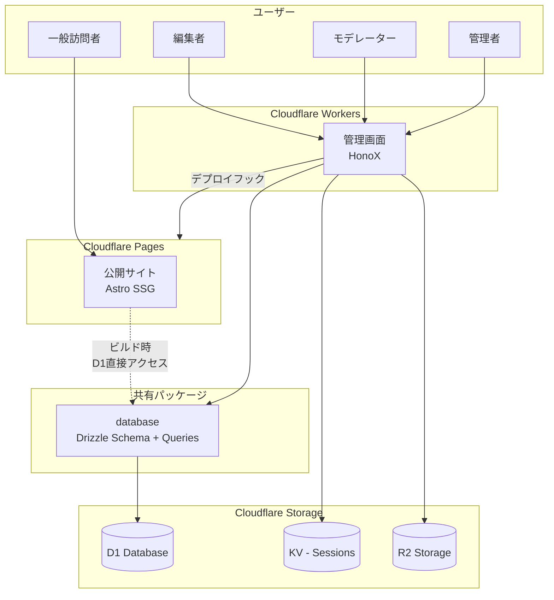
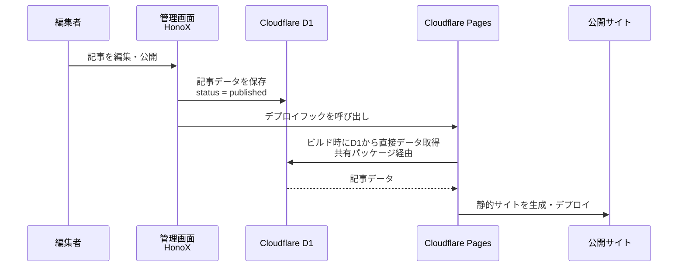
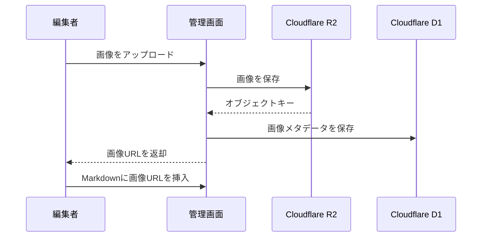
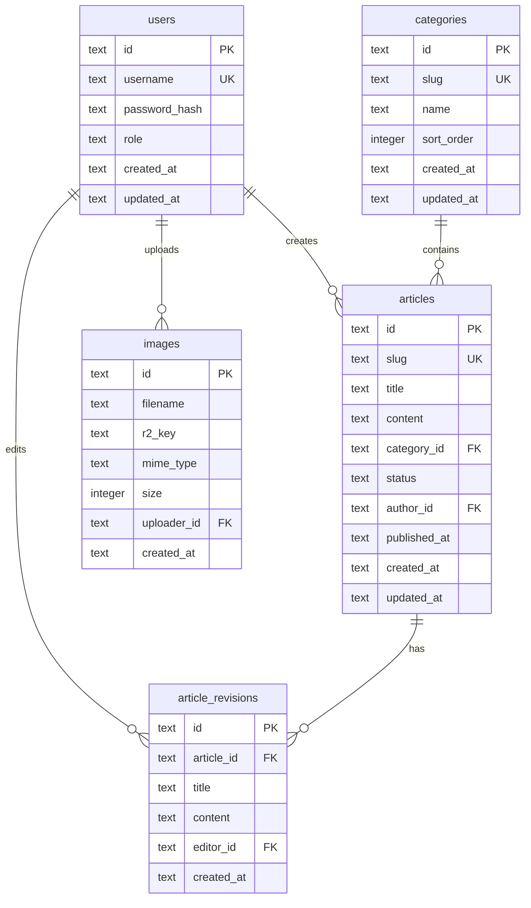

# KotaServer Wiki - 技術設計

## 技術スタック

### 概要

| レイヤー | 技術 |
|----------|------|
| 公開Wiki | Astro（SSG） |
| 管理画面 | HonoX（Islands Architecture） |
| ORM | Drizzle ORM |
| データベース | Cloudflare D1 |
| セッション管理 | Cloudflare KV |
| 画像ストレージ | Cloudflare R2 |
| ホスティング | Cloudflare Pages |
| ランタイム | Cloudflare Workers |

### 詳細

#### HonoX

- Honoベースのメタフレームワーク
- ファイルベースルーティング
- Islands Architectureによる部分的ハイドレーション
- Markdownエディタなどインタラクティブな部分のみクライアントJS

#### Drizzle ORM

- TypeScript-firstのORM
- Cloudflare D1との優れた互換性
- 型安全なクエリビルダー
- マイグレーション管理

#### 共有パッケージ（database）

- AstroとHonoXの両方からD1に直接アクセス
- Drizzleスキーマと型定義を共有
- APIレイヤーを挟まないシンプルな構成

---

## プロジェクト構成

### モノレポ構成（pnpm workspaces）

```
kotaserver-website/
├── package.json
├── pnpm-workspace.yaml
├── packages/
│   ├── website/          # 公開サイト（Astro）
│   │   ├── src/
│   │   │   ├── pages/
│   │   │   │   ├── index.astro
│   │   │   │   └── wiki/
│   │   │   │       ├── index.astro
│   │   │   │       ├── [slug].astro
│   │   │   │       ├── category/
│   │   │   │       │   └── [slug].astro
│   │   │   │       └── search.astro
│   │   │   └── ...
│   │   └── package.json
│   │
│   ├── admin/            # 管理画面（HonoX）
│   │   ├── app/
│   │   │   ├── routes/
│   │   │   │   ├── index.tsx
│   │   │   │   ├── login.tsx
│   │   │   │   ├── articles/
│   │   │   │   ├── categories/
│   │   │   │   └── users/
│   │   │   ├── islands/
│   │   │   │   ├── markdown-editor.tsx
│   │   │   │   └── ...
│   │   │   └── api/
│   │   │       └── [...route].ts
│   │   └── package.json
│   │
│   └── database/         # 共有パッケージ
│       ├── src/
│       │   ├── schema.ts       # Drizzle スキーマ
│       │   ├── queries/        # クエリ関数
│       │   └── types.ts        # 共有型定義
│       ├── drizzle/
│       │   └── migrations/     # マイグレーションファイル
│       └── package.json
│
└── plans/                # 計画ドキュメント
```

---

## システムアーキテクチャ



---

## データフロー

### 記事公開フロー



### 画像アップロードフロー



---

## データベーススキーマ

### ER図



### テーブル定義

#### users

| カラム | 型 | 制約 | 説明 |
|--------|------|------|------|
| id | TEXT | PK | UUID |
| username | TEXT | UNIQUE, NOT NULL | ユーザー名 |
| password_hash | TEXT | NOT NULL | bcryptハッシュ |
| role | TEXT | NOT NULL | admin / moderator / editor |
| created_at | TEXT | NOT NULL | ISO 8601形式 |
| updated_at | TEXT | NOT NULL | ISO 8601形式 |

#### categories

| カラム | 型 | 制約 | 説明 |
|--------|------|------|------|
| id | TEXT | PK | UUID |
| slug | TEXT | UNIQUE, NOT NULL | URLスラッグ |
| name | TEXT | NOT NULL | カテゴリ名 |
| sort_order | INTEGER | NOT NULL, DEFAULT 0 | 表示順（サイドメニューでの並び順） |
| created_at | TEXT | NOT NULL | ISO 8601形式 |
| updated_at | TEXT | NOT NULL | ISO 8601形式 |

#### articles

| カラム | 型 | 制約 | 説明 |
|--------|------|------|------|
| id | TEXT | PK | UUID |
| slug | TEXT | UNIQUE, NOT NULL | URLスラッグ |
| title | TEXT | NOT NULL | タイトル |
| content | TEXT | NOT NULL | Markdown本文 |
| category_id | TEXT | FK → categories.id | カテゴリ |
| status | TEXT | NOT NULL | draft / published |
| author_id | TEXT | FK → users.id | 作成者 |
| published_at | TEXT | NULL | 公開日時 |
| created_at | TEXT | NOT NULL | ISO 8601形式 |
| updated_at | TEXT | NOT NULL | ISO 8601形式 |

#### article_revisions

| カラム | 型 | 制約 | 説明 |
|--------|------|------|------|
| id | TEXT | PK | UUID |
| article_id | TEXT | FK → articles.id | 記事ID |
| title | TEXT | NOT NULL | タイトル |
| content | TEXT | NOT NULL | Markdown本文 |
| editor_id | TEXT | FK → users.id | 編集者 |
| created_at | TEXT | NOT NULL | ISO 8601形式 |

#### images

| カラム | 型 | 制約 | 説明 |
|--------|------|------|------|
| id | TEXT | PK | UUID |
| filename | TEXT | NOT NULL | 元ファイル名 |
| r2_key | TEXT | NOT NULL | R2オブジェクトキー |
| mime_type | TEXT | NOT NULL | MIMEタイプ |
| size | INTEGER | NOT NULL | ファイルサイズ（バイト） |
| uploader_id | TEXT | FK → users.id | アップロード者 |
| created_at | TEXT | NOT NULL | ISO 8601形式 |

---

## データアクセス設計

APIレイヤーは設けず、共有パッケージ（database）経由でD1に直接アクセスする。

### 共有パッケージの関数

#### 記事

| 関数 | 説明 |
|------|------|
| `getPublishedArticles()` | 公開記事一覧を取得 |
| `getArticleBySlug(slug)` | スラッグで記事を取得 |
| `getAllArticles()` | 全記事一覧を取得（下書き含む） |
| `getArticleById(id)` | IDで記事を取得 |
| `createArticle(data)` | 記事を作成 |
| `updateArticle(id, data)` | 記事を更新 |
| `deleteArticle(id)` | 記事を削除 |
| `publishArticle(id)` | 記事を公開 |
| `unpublishArticle(id)` | 記事を非公開 |
| `getArticleRevisions(articleId)` | 編集履歴を取得 |

#### カテゴリ

| 関数 | 説明 |
|------|------|
| `getCategories()` | カテゴリ一覧を取得 |
| `createCategory(data)` | カテゴリを作成 |
| `updateCategory(id, data)` | カテゴリを更新 |
| `deleteCategory(id)` | カテゴリを削除 |

#### ユーザー

| 関数 | 説明 |
|------|------|
| `getUserByUsername(username)` | ユーザー名でユーザーを取得 |
| `getUserById(id)` | IDでユーザーを取得 |
| `getUsers()` | ユーザー一覧を取得 |
| `createUser(data)` | ユーザーを作成 |
| `updateUserRole(id, role)` | ユーザー権限を変更 |
| `deleteUser(id)` | ユーザーを削除 |

#### 画像

| 関数 | 説明 |
|------|------|
| `saveImageMetadata(data)` | 画像メタデータを保存 |
| `deleteImageMetadata(id)` | 画像メタデータを削除 |

---

## セキュリティ設計

### 認証

- セッションベース認証（Cookieを使用）
- パスワードはbcryptでハッシュ化
- セッショントークンはセキュアなランダム文字列

### セッション管理

- **保存先**: Cloudflare KV
- **キー**: セッションID（ランダムUUID）
- **値**: ユーザーID、ロール、作成日時
- **TTL**: 7日間（設定可能）
- **Cookie設定**:
  - `HttpOnly`: true
  - `Secure`: true
  - `SameSite`: Strict
  - `Path`: /

### 認可

- ロールベースアクセス制御（RBAC）
- 各APIエンドポイントで権限チェック

### その他

- CSRF対策
- Rate Limiting
- 入力値のバリデーション（Zod）
