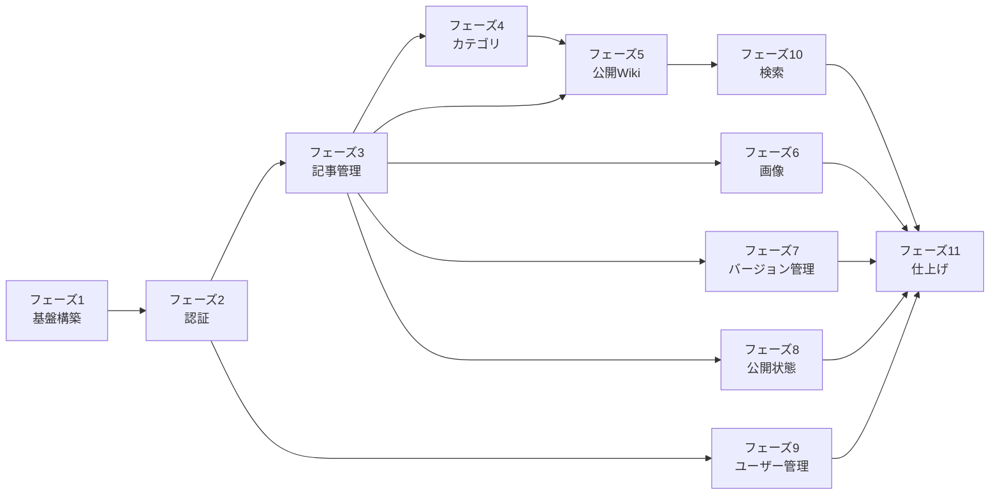

# KotaServer Wiki - 実装計画

## 実装フェーズ

### フェーズ1: 基盤構築

モノレポ構成とCloudflareリソースのセットアップ。

#### タスク

- [ ] モノレポ構成のセットアップ
  - [x] pnpm-workspace.yaml の更新
  - [x] packages/website への既存コード移動
  - [ ] packages/admin の作成（HonoX）
  - [ ] packages/database の作成
  - [ ] 共通設定（TypeScript, ESLint等）

- [ ] Cloudflareリソースの作成
  - [ ] D1データベースの作成
  - [ ] KV名前空間の作成（セッション管理用）
  - [ ] R2バケットの作成
  - [ ] wrangler.toml の設定

- [ ] データベース基盤
  - [ ] Drizzle ORMのセットアップ
  - [ ] スキーマ定義
  - [ ] 初期マイグレーション作成・実行

---

### フェーズ2: 認証システム

管理画面へのログイン機能を実装。

#### タスク

- [ ] 認証基盤
  - [ ] パスワードハッシュ化（bcrypt）
  - [ ] セッション管理
  - [ ] 認証ミドルウェア

- [ ] 管理画面UI
  - [ ] ログインページ
  - [ ] ログアウト機能
  - [ ] 認証状態の管理

- [ ] 初期管理者の作成
  - [ ] シードスクリプト作成

---

### フェーズ3: 記事管理（MVP）

記事のCRUD機能を実装。

#### タスク

- [ ] データアクセス関数実装
  - [ ] 記事一覧取得
  - [ ] 記事詳細取得
  - [ ] 記事作成
  - [ ] 記事更新
  - [ ] 記事削除

- [ ] 管理画面UI
  - [ ] 記事一覧ページ
  - [ ] 記事作成ページ
  - [ ] 記事編集ページ
  - [ ] Markdownエディタ（Island）
  - [ ] リアルタイムプレビュー

---

### フェーズ4: カテゴリ管理

フラットなカテゴリ機能を実装。

#### タスク

- [ ] データアクセス関数実装
  - [ ] カテゴリ一覧取得
  - [ ] カテゴリ作成
  - [ ] カテゴリ更新
  - [ ] カテゴリ削除
  - [ ] カテゴリの並び替え

- [ ] 管理画面UI
  - [ ] カテゴリ一覧ページ
  - [ ] カテゴリ作成・編集フォーム

- [ ] 記事との連携
  - [ ] 記事作成・編集時のカテゴリ選択

---

### フェーズ5: 公開Wiki

Astroで公開Wikiページを実装。

#### タスク

- [ ] Astro設定
  - [ ] Cloudflare D1バインディング設定
  - [ ] 共有パッケージ経由でのデータ取得

- [ ] ページ実装
  - [ ] Wikiトップページ（/wiki）
  - [ ] 記事ページ（/wiki/[slug]）
  - [ ] 検索ページ（/wiki/search）

- [ ] コンポーネント
  - [ ] ナビゲーション
  - [ ] サイドバー（全カテゴリ・記事一覧）
  - [ ] 記事カード
  - [ ] Markdownレンダラー

- [ ] スタイリング
  - [ ] レスポンシブデザイン
  - [ ] 既存サイトとの統一感

---

### フェーズ6: 画像アップロード

R2を使った画像管理機能を実装。

#### タスク

- [ ] API実装
  - [ ] 画像アップロード
  - [ ] 画像削除
  - [ ] 画像一覧取得

- [ ] 管理画面UI
  - [ ] 画像アップロードコンポーネント（Island）
  - [ ] ドラッグ&ドロップ対応
  - [ ] Markdownエディタへの画像挿入

- [ ] 画像配信
  - [ ] R2パブリックアクセス設定
  - [ ] 画像URL生成

---

### フェーズ7: バージョン管理

編集履歴と差分表示機能を実装。

#### タスク

- [ ] API実装
  - [ ] リビジョン保存（記事更新時）
  - [ ] リビジョン一覧取得
  - [ ] リビジョン詳細取得

- [ ] 管理画面UI
  - [ ] 編集履歴ページ
  - [ ] 差分表示コンポーネント
  - [ ] 過去バージョンへの復元

---

### フェーズ8: 公開状態管理

下書き・公開の切り替えとデプロイ機能を実装。

#### タスク

- [ ] API実装
  - [ ] 記事公開
  - [ ] 記事非公開
  - [ ] デプロイトリガー

- [ ] 管理画面UI
  - [ ] 公開状態の表示・切り替え
  - [ ] デプロイボタン
  - [ ] デプロイ状態の表示

- [ ] Cloudflare Pages連携
  - [ ] デプロイフックの設定
  - [ ] Webhook呼び出し

---

### フェーズ9: ユーザー管理

ユーザーの招待と権限管理を実装。

#### タスク

- [ ] API実装
  - [ ] ユーザー一覧取得
  - [ ] ユーザー招待
  - [ ] 権限変更
  - [ ] ユーザー削除

- [ ] 管理画面UI
  - [ ] ユーザー一覧ページ
  - [ ] ユーザー招待フォーム
  - [ ] 権限変更UI

- [ ] 招待フロー
  - [ ] 招待トークン生成
  - [ ] パスワード設定ページ

---

### フェーズ10: 検索機能

全文検索機能を実装。

#### タスク

- [ ] データベース
  - [ ] FTS（Full-Text Search）テーブル作成
  - [ ] 検索インデックス更新トリガー

- [ ] API実装
  - [ ] 検索エンドポイント
  - [ ] 検索結果のハイライト

- [ ] 公開Wiki
  - [ ] 検索フォーム
  - [ ] 検索結果ページ

---

### フェーズ11: 仕上げ

品質向上とドキュメント整備。

#### タスク

- [ ] パフォーマンス最適化
  - [ ] 画像最適化
  - [ ] キャッシュ設定
  - [ ] バンドルサイズ最適化

- [ ] セキュリティ強化
  - [ ] CSRF対策
  - [ ] Rate Limiting
  - [ ] セキュリティヘッダー

- [ ] テスト
  - [ ] ユニットテスト
  - [ ] E2Eテスト

- [ ] ドキュメント
  - [ ] 運用マニュアル
  - [ ] 開発者ガイド

---

## 依存関係

---

## MVP（最小実行可能製品）

以下のフェーズを完了すれば、基本的なWikiとして運用開始可能：

1. **フェーズ1**: 基盤構築
2. **フェーズ2**: 認証システム
3. **フェーズ3**: 記事管理（MVP）
4. **フェーズ4**: カテゴリ管理
5. **フェーズ5**: 公開Wiki

MVP後に追加機能を段階的に実装していく。
